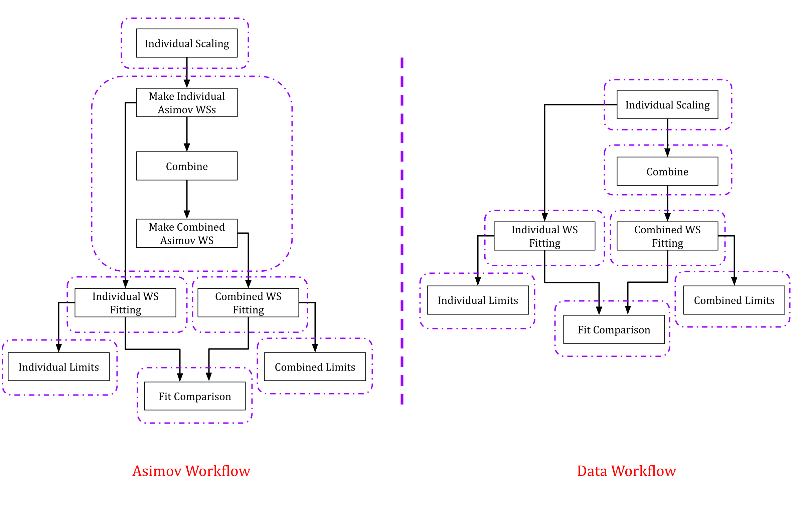

This Repository is being built for combination of  Single VLQ Searches within ATLAS. More information can be found in the [combination twiki](https://twiki.cern.ch/twiki/bin/viewauth/AtlasProtected/SingleCombinationRun2).

To clone this project, run the following commands:

```
	git clone ssh://git@gitlab.cern.ch:7999/atlas-phys/exot/hqt/VLQ_Single_Run2/Run2SingleVLQCombination.git
	cd Run2SingleVLQCombination
	git submodule init
	git submodule update
```
## Setup
The `setup.sh` script should be run to set up the necessary StatAnalysis release and the environment variables.


## WorkspaceChecks

``WorkspaceChecks`` is used to check that the individual workspaces are built in the right way for combination. It checks the names of the samples, regions, systematic nuisance parameters, and normalization factors. It needs to be compiled during the first time (and after any changes to it) by running the `make` command.


## Running combination

All steps of the combination workflow can be run using the super-wrapper `CombRunner.py`. 

```
python python/CombRunner.py <options>
```
where `<options>` can be chosen from the following list-

```
  -h, --help			 show this help message and exit
  --data-loc		     	 location of data
  --inws-subdir         	 location of input ws sub-directories
  --scaledws-subdir     	 location of scaled ws sub-directories
  --scalingconfig-subdir	 location of scaling config sub-directories
  --asimovws-subdir		 location of asimov ws sub-directories
  --asimovconfig-subdir		 location of asimov config sub-directories
  --combinedws-subdir		 location of combined ws sub-directories
  --combconfig-subdir		 location of combination config sub-directories
  --fittedws-subdir		 location of fitted ws sub-directories
  --limit-subdir		 location of limit sub-directories
  --log-subdir			 location of log sub-directories
  --masses			 Provide a comma separated list of masses with GeV units (e.g. 1200,1600)
  --kappas			 Provide a comma separated list of kappas (e.g. 0.3,0.5)
  --brws	    		 Provide a comma separated list of T > Wb BRs (e.g. 0.0,0.5)
  --mu	                	 Choice of mu for asimov dataset
  --fit-type			 Provide the fit type: BONLY (default) or SPLUSB
  --use-data			 set if real data is to be used, otherwise asimov will be used
  --skip-scaling		 set if scaling input workspaces is not required (i.e. already done)
  --skip-asimov			 set if real data is to be used instead of asimov
  --skip-combine          	 set if combination of workspaces is not required
  --skip-separate-fitting	 set if independent fitting of workspaces is not required
  --skip-combined-fitting        set if fitting of combined workspaces is not required
  --skip-separate-limits  	 set if independent limits are not required
  --skip-combined-limits  	 set if combined limits not required
  --skip-trexf-configs    	 set if TRExFitter Configs are not required
  --skip-trexf-comp       	 set if TRExFitter Comps are not required
```
Running a full combination chain will require a number of steps to be completed. The workflows for combination with Asimov and data are illustrated with the flowchart diagrams below-



Each bounding box of the workflow diagram represents the part that can be standalone executed by the workflow given (a) the previous steps are already done, (b) the corresponding outputs from those steps are preserved, and (c) the same directory structure is used.

The backbone of this code is in the `CombUtils.py` module which defines the necessary class and wrappers to run the different steps of combination. Please note that-

- The `--data-loc` option takes in the full path to a location or the relative path of the directory with respect to the directory from where the code is being run. This is where all results and workspaces are meant to be stored. Before running the combination, one must place the necessary input workspaces in a particular directory structure. For each participating analysis, there should be a directory of the format `<dataloc>/<wsloc>/<ANACODE>` where `<dataloc>` is the directory specified by the `--data-loc` option (the default choice is `data`), `<wsloc>` is the location specified by the `--inws-subdir` (the default choice is `workspaces/input_workspaces` option  and `<ANACODE>` is the analysis codename specified in the [combination twiki](https://twiki.cern.ch/twiki/bin/viewauth/AtlasProtected/SingleCombinationRun2)
- The workspaces must be named as `<ANACODE>_combined_<SIGCODE>.root` where `<SIGCODE>` is the signal tag in the form `MxxKyyy`. `xx` is the signal mass in units of 100 GeV and `yyy` is hundred times the signal kappa, with preceding zero(s) if needed. For instance, the workspace for a 1.4 TeV signal at a kappa = 0.35 from the OSML analysis must be named `SPT_OSML_combined_M14K035.root` and placed under the directory `<dataloc>/<wsloc>/SPT_OSML/`
- The combination workflow allows either a specific asimov run with a certain choice of mu or a run with observed data in a single call, but not both. This is controlled by the `--skip-asimov` and `--use-data` flags. To run a  fit with data, both flags must be passed to command line argument.  Without the `--skip-asimov` flag the code will run the Asimov workflow and will override the`--use-data` flag. Using the `--skip-asimov` flag alone will cause the code to skip generation of Asimov Workspaces but will run the rest of the workflow assuming the Asimov workspaces already exist.
